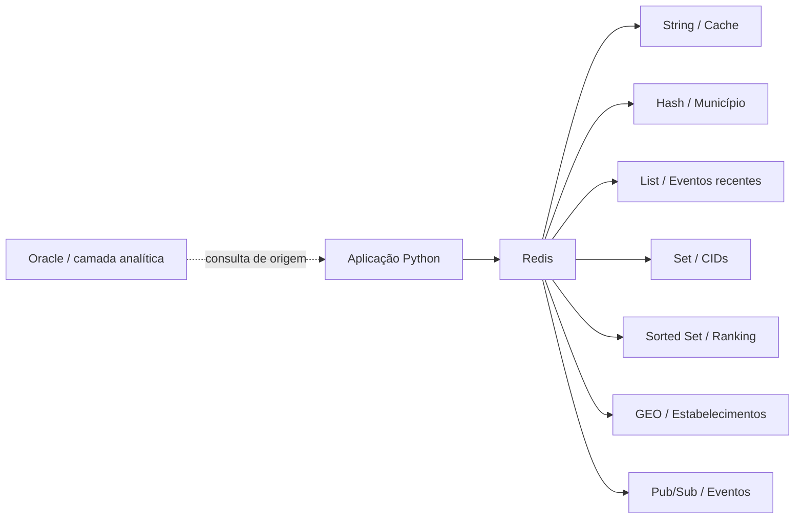

# FIAP Data Architecture + Redis

> Laboratório prático de **Redis + Python (redis-py)** aplicado ao contexto do projeto acadêmico MindLink.

Este repositório foi criado para consolidar os conceitos da disciplina **Data Architecture, Analytics and NoSQL Solutions**, da FIAP, colocando o Redis em um cenário de aplicação realista.

## Objetivo

Demonstrar como um banco NoSQL **chave-valor** pode complementar uma camada analítica tradicional, usando Redis para:

- cache de respostas frequentes;
- objetos com **Hashes**;
- filas e histórico curto com **Lists**;
- conjuntos com **Sets**;
- rankings com **Sorted Sets**;
- consultas geoespaciais com **GEO**;
- expiração de dados com **TTL**;
- comunicação assíncrona com **Pub/Sub**.

O projeto usa dados **simulados e não clínicos** inspirados no domínio da MindLink. Nenhum dado pessoal ou credencial real é versionado.

## Arquitetura



### Onde o Redis entra?

O Redis **não substitui automaticamente o banco analítico**. Neste laboratório, ele funciona como uma camada rápida para informações que precisam ser consultadas, ordenadas, agrupadas ou distribuídas com baixa latência.

Exemplo:

```
Consulta analítica
      ↓
Resultado calculado
      ↓
Redis Cache (TTL)
      ↓
Aplicação responde rapidamente
```

## Estrutura

```
fiap-data-architecture-redis/
├── src/
│   ├── config.py
│   ├── redis_client.py
│   ├── seed.py
│   ├── demo.py
│   └── geo_demo.py
├── tests/
│   └── test_keys.py
├── .env.example
├── .gitignore
├── docker-compose.yml
├── requirements.txt
└── README.md
```

## Como executar

### 1. Subir o Redis local

Pré-requisitos:

- Docker
- Docker Compose
- Python 3.11+

```bash
docker compose up -d
```

Verifique:

```bash
docker compose ps
```

### 2. Criar ambiente Python

Windows PowerShell:

```powershell
python -m venv .venv
.\.venv\Scripts\Activate.ps1
pip install -r requirements.txt
```

### 3. Configurar variáveis

Copie:

```powershell
Copy-Item .env.example .env
```

Para o laboratório local, os valores padrão funcionam sem alteração.

### 4. Popular o Redis

```powershell
python -m src.seed
```

### 5. Executar a demonstração

```powershell
python -m src.demo
```

Para testar GEO:

```powershell
python -m src.geo_demo
```

## Conceitos demonstrados

| Conceito | Redis | Uso no projeto |
|---|---|---|
| String | `SET/GET` | cache e status |
| Hash | `HSET/HGETALL` | objeto de município |
| List | `LPUSH/LRANGE` | eventos recentes |
| Set | `SADD/SMEMBERS` | códigos de diagnóstico |
| Sorted Set | `ZADD/ZREVRANGE` | ranking de municípios |
| Expiração | `EXPIRE/TTL` | cache temporário |
| GEO | `GEOADD/GEOSEARCH` | estabelecimentos próximos |
| Pub/Sub | `PUBLISH/SUBSCRIBE` | evento de atualização |

## Segurança

Credenciais não ficam no código.

Use:

- `.env` para configuração local;
- `.env.example` apenas como modelo;
- nunca publique senha, host privado ou URL de conexão do Redis Cloud.

O arquivo `.gitignore` bloqueia `.env`, ambientes virtuais e arquivos temporários.

## Relação com a disciplina

O projeto foi construído a partir dos conceitos trabalhados na aula de Redis:

- banco NoSQL chave-valor;
- estruturas de dados nativas;
- operações atômicas;
- cache e expiração;
- ranking;
- geolocalização;
- Pub/Sub;
- integração com Python por `redis-py`.

## Próximas evoluções

- conectar uma fonte analítica real da MindLink;
- adicionar uma API REST;
- medir cache hit/miss;
- comparar tempo de resposta com e sem cache;
- integrar Redis a uma aplicação web;
- avaliar Redis Cloud.

## Referências

- Redis Commands: https://redis.io/docs/latest/commands/
- Redis Cloud Quick Start: https://redis.io/docs/latest/operate/rc/rc-quickstart/
- Redis Insight: https://redis.io/docs/latest/operate/rc/databases/connect/insight-cloud/
- Python client: https://redis.readthedocs.io/

---

**FIAP · Data Architecture, Analytics and NoSQL Solutions · 2026**
